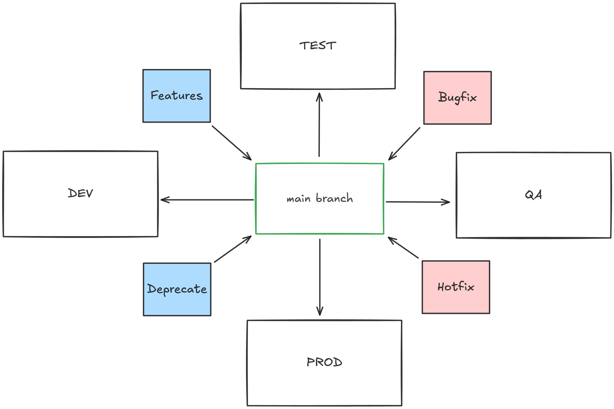
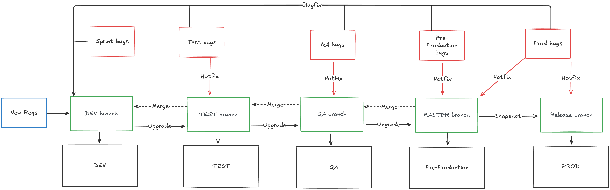

# Environment branching techniques

Or, the issue with starting from one main branch as a whole and never splitting it up.

## The one-branch-rules-all rule

This could be an exaggerated image. What we see here is a single point of entry that is the driven force between all our environments. This however will present us with a not-so-nice issue.

`We always deploy a snapshot of the main branch which becomes obsolete as soon as a new piece of content is added to the main branch.`

In most teams, this setup presents us with some disadvantages:

- Cherry picking techniques have to be used to fix certain environments.
- Features, bugfixes, hotfixes and deprecated code are all the same from a process point of view.
- In bigger teams, this creates a volatile developer environment. (Sometimes hostile envrionments)
- Teams are depending on the same branch
- Teams are working on the same branch

## Splitting main up in designated branches

The idea behind this technique is that each environment gets its own dedicated branch on which developers can work.

|branch|environment|comment
|--|--|--|
|dev|development|necessary with bigger teams and to see changes without breaking production
|test|test|necessary when test teams are independantly checking the outcomes
|qa|qa|necessary when QA-teams are independantly checking the outcomes
|uat|uat|necessary when UAT-teams are independantly checking the outcomes
|demo|demo|necessary when sales-teams are independantly showing demos
|master|production|necessary for having a production environment
|master|pre-production|necessary when having an environment that resembles the latest release
|master_[release_version]|production|necessary for having a production environment

This also presents us with some disadvantages

- Upgrading a branch must always happen under a strict form of communication.
- strict merge strategies per branch
- More repositories
- More costs

### Merging strategies
|what|environment|on which branch|merge to|when
|--|--|--|--|--|
|new feature|*|dev|test|all tests are green
|bugfix|*|dev|test|all tests are green
|hotfix|*|the branch where it broke|all lower branches (*)|hotfix was tested on that branch
