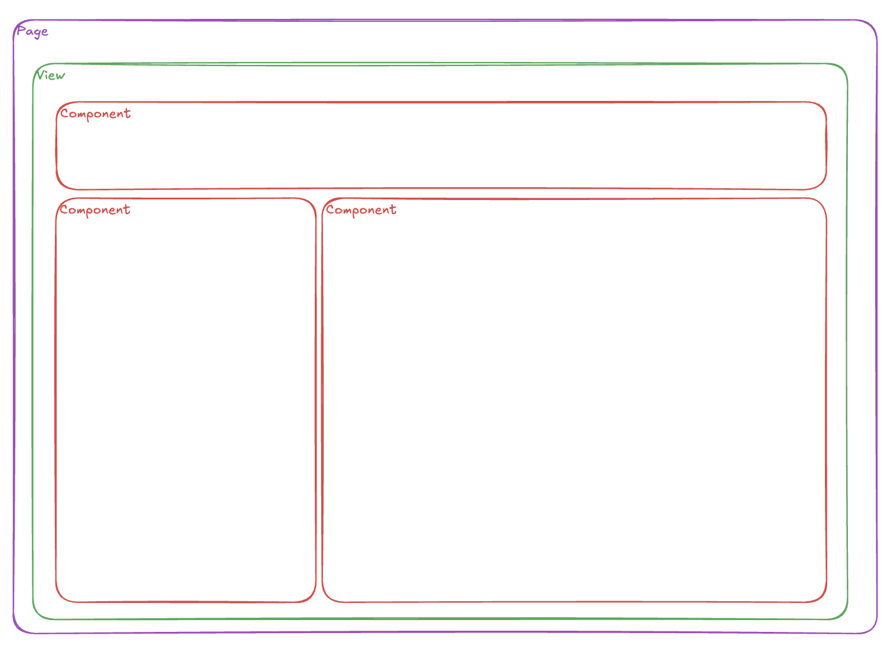

# A Simple Page Setup

This idea with a frontend page-setup is that it should be very clear in what it does. We want our code base to be as straight forward as possible to maintain easy access to the codebase for new team members.

## Page

The page is component that lies at the highest level and should be a near-match with the route that the user navigates to.
A page should be the backbone of the complete view that the user sees. As such, the page should be the one-and-only place where BE interactions are made, or setup when more complex views are into place.

As the page lies at the highest level inside the application structure, it also means that it is the perfect place to access route params and BE-services.
When working inside an application that holds a lot of configuration, the page is also the first one to load that configuration and set the view up as requested by the end-user.

A page may have state, although it should be declared as a bridge between the user and the BE. As such, it should provide BE-client functionalities that views can use to access the BE-service.

## View

A view is a component that lies inside a page component. It should be clear that a view is a link between business components. As such, the view itself should have state that is drilled down to the components that it consists of.

## Component
A Component is an element or business component that lies at the lowest level. A component may not have state! Or should try to have no state. Its sole purpose is for the user to interact with or to show information that is exists out of. User interactions are hoisted to the view which in turn will set these values to use and will interact with the BE whenever this is necessary.

